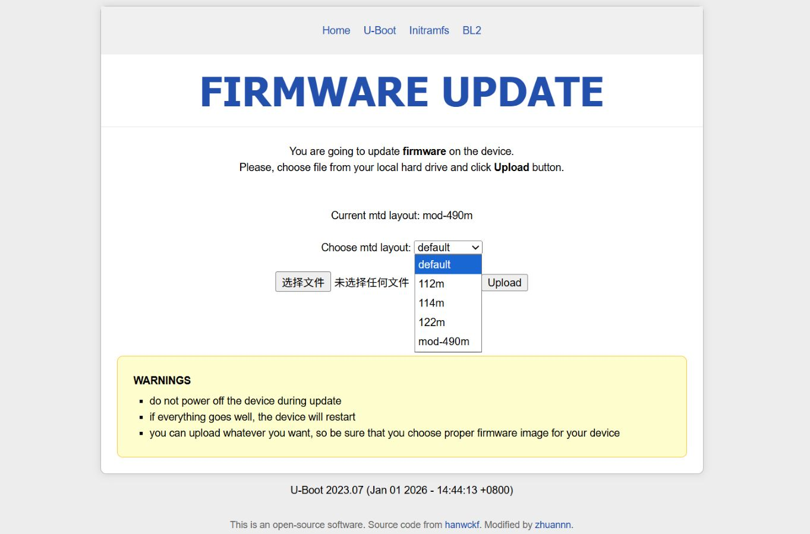

# OpenWrt/ImmortalWrt and U-Boot for Cudy TR3000 (Hard-modified to 512MB Flash)

## Screenshots
U-Boot:  

## Quick Start
1. Download U-Boot and system firmware from the [Releases](https://github.com/zhuannn/cudy-tr3000-512/releases)
2. Access the existing U-Boot
3. Flash the new U-Boot
4. Select the `mod-490` MTD layout and flash the system firmware

## Release Notes
Firmware in the Releases is built and uploaded via GitHub Actions using upstream source code. The default IP address is 192.168.1.1. Release tags are explained as follows: 
- `ImmortalWrt/Openwrt-Tag-Time`: System firmware. Tag = upstream source version; Time = build time. The `kmod.tar.gz` bundled with the firmware contains the corresponding kmod packages.
- `Uboot-Time`: Multi-partition U-Boot. Time = build time

⚠️ Always verify the MD5 or SHA256 checksum before flashing U-Boot. Flashing an incorrect U-Boot may brick the device.

## Project Structure
- `.github/workflows`: GitHub Actions workflow configurations
    - `immortalwrt-builder-kmod.yml`: Builds all kmod packages
    - `immortalwrt-builder.yml`: Minimal build
    - `uboot-builder.yaml`: Builds U-Boot
- `Actions-OpenWRT`: Custom scripts for building OpenWrt systems. For usage, please refer to the original repository
- `openwrt-mod`: Added DTS files, device model definitions, and build configurations for the 512MB version
- `uboot-mod`: Modifications made to U-Boot

## How to
- Hard-modding a 128MB router to 512MB Flash: [Hardware Modification Steps](docs/Modify_Flash.md)
- Using your own kmod software repository: [Configuring Third-Party kmod](docs/Configure_Kmod.md)
- Compiling your own modified firmware/U-Boot: [Build Steps](docs/How_to_Compile.md)

## Known Issues
- Due to the changed device name, updating from other firmware to this firmware may trigger an "incompatible hardware" warning. You will need to force-apply the firmware.
- For 128MB routers hard-modded to 256MB, there is a chance that **U-Boot** cannot obtain an IP address via DHCP. In this case, manually set your computer's IP address to another address in the 192.168.1.1 subnet. This issue has not been observed in the 512MB version.

## References
- [P3TERX/Actions-OpenWrt](https://github.com/P3TERX/Actions-OpenWrt) - GitHub Actions workflow configuration
- [weekdaycare/bl-mt798x-dhcpd](https://github.com/weekdaycare/bl-mt798x-dhcpd) - Multi-partition U-Boot configuration
- [hanwckf/bl-mt798x](https://github.com/hanwckf/bl-mt798x) - U-Boot source code
- [immortalwrt/immortalwrt](https://github.com/immortalwrt/immortalwrt) - ImmortalWrt source code

## License
- License for the Code   
The code in this repository is licensed under the GNU General Public License v2.0 (GPLv2).

- License for the Documentation  
The documentation in this repository is licensed under the Creative Commons Attribution-NonCommercial-ShareAlike 4.0 International License (CC BY-NC-SA 4.0).
