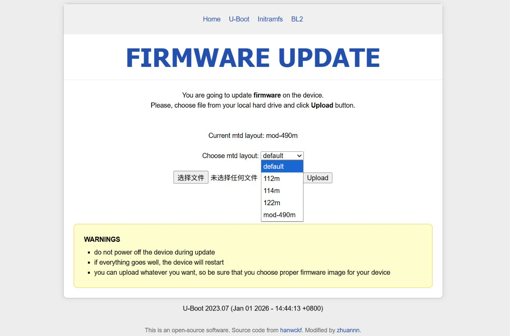

# 适用于Cudy TR3000（硬改512MB Flash）的OpenWrt/ImmortalWrt 和 U-Boot

## Screenshots
U-boot:  

## Quick Start
1. 在[Releases](https://github.com/zhuannn/cudy-tr3000-512/releases)中下载U-boot和系统固件
2. 进入现有的U-boot
3. 刷入新的U-boot
4. 选择mtd布局`mod-490`，刷入系统固件

## Releases Note
Releases中的固件由Github Action拉取上游源码编译上传，默认地址均为192.168.1.1。Release Tag说明如下: 
- `ImmortalWrt/Openwrt-Tag-Time`: 系统固件，Tag-上游源码版本；Time-编译时间。随固件发布的kmod.tar.gz为对应kmod软件包
- `Uboot-Time`: 多分区Uboot，Time-编译时间

⚠️刷入Uboot前务必核对md5或sha256，错误的Uboot可能导致设备变砖。

## Project Structure
- `.github/workflows`: Action工作流配置
    - `immortalwrt-builder-kmod.yml`: 编译所有kmod
    - `immortalwrt-builder.yml`: 最小化编译
    - `uboot-builder.yaml`: 编译uboot
- `Actions-OpenWRT`: 构建OpenWrt系统的自定义脚本，用法请参考原仓库
- `openwrt-mod`: 新增512MB版本的dts文件及型号定义、编译配置
- `uboot-mod`: 对uboot做出的改动

## How to
- 将128MB的路由器硬件改造为512MB Flash: [硬改步骤](docs/Modify_Flash.md)
- 使用自己的kmod软件源: [配置第三方kmod](docs/Configure_Kmod.md)
- 自己编译修改的固件/Uboot: [编译步骤](docs/How_to_Compile.md)

## Known Issue
- 由于修改了设备名称，从其他固件更新到此固件时可能弹出警告不兼容的硬件，需要强制应用固件
- 128MB硬改256MB，**uboot**有一定概率无法DHCP获取IP地址，需将电脑手动设置为192.168.1.1网段的其他地址，512MB版本暂未发现

## References
- [P3TERX/Actions-OpenWrt](https://github.com/P3TERX/Actions-OpenWrt) - Action工作流配置
- [weekdaycare/bl-mt798x-dhcpd](https://github.com/weekdaycare/bl-mt798x-dhcpd) - 多分区Uboot配置
- [hanwckf/bl-mt798x](https://github.com/hanwckf/bl-mt798x) - Uboot源码
- [immortalwrt/immortalwrt](https://github.com/immortalwrt/immortalwrt) - ImmortalWrt源码

## License
- License for the Code   
The code in this repository is licensed under the GNU General Public License v2.0 (GPLv2).

- License for the Documentation  
The documentation in this repository is licensed under the Creative Commons Attribution-NonCommercial-ShareAlike 4.0 International License (CC BY-NC-SA 4.0).
