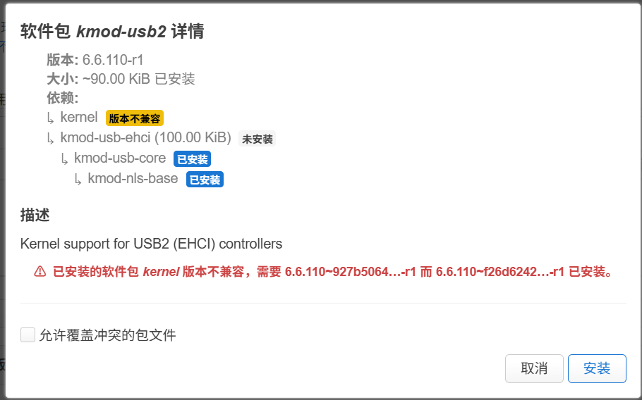
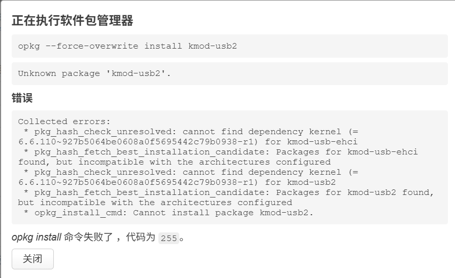

# 如何配置使用自己的kmod源

## 为什么要配置自己的kmod源
可能由于修改了dts中关于分区大小的配置，或者编译环境和ImmortalWrt官方不一样，本仓库Action编译的系统固件的内核vermagic与官方软件源不一样。

以ImmortalWrt 24.10.4为例，官方kmod软件源地址[https://downloads.immortalwrt.org/releases/24.10.4/targets/mediatek/filogic/kmods/](https://downloads.immortalwrt.org/releases/24.10.4/targets/mediatek/filogic/kmods/) 中的内核版本为`6.6.110-1-927b5064be0608a0f5695442c79b0938`，本仓库编译的固件内核版本并非此版本。

如果在路由器中配置官方kmod软件源，试图安装kmod软件包，会产生报错，如下图所示

这时候只能将自己编译系统时产生的kmod ipk手动上传安装，但是多个软件包存在依赖关系时，需要按顺序安装，非常繁琐。

## 如何自己编译全部的kmod软件包
在**空白的**`.config`中增加`CONFIG_ALL_KMODS=y`，然后运行`make menuconfig`使配置生效。

编译产生的kmod包路径：`bin/targets/mediatek/filogic/packages`

## 如何配置使用自己的kmod源
工具：[rejetto/hfs](https://github.com/rejetto/hfs)

如果使用本仓库Releases发布的固件，配套kmod包已经随固件一起发布（即kmod.tar.gz），需要将其下载后解压到电脑中。

1. 下载与解压  
从 HFS 官方 GitHub 页面 下载 hfs。
解压后，将 hfs.exe 和 kmod 文件夹放在你方便访问的目录中。
2. 启动 HFS 服务  
双击 hfs.exe 启动 HFS 程序。浏览器将打开 HFS 管理页面。
3. 配置 HFS  
在 HFS 管理页面，点击右上角的 Options（选项）。
在 Listen address 中指定监听地址（一般选择 0.0.0.0 或本机 IP 地址）。
在 Port 中设置端口号（可以保持默认 8080 或根据需要修改）。
4. 添加共享文件夹  
返回主界面，点击 Shared files，添加一个文件夹，选择解压后的 kmod 文件夹路径（包含 ipk 和 Packages.gz 文件）。
5. 访问本地软件源  
打开浏览器，输入本机地址加端口号，如：http://192.168.1.100:8080。在浏览器中，你将看到你刚才共享的文件夹。
6. 配置 OpenWrt 使用本地软件源
进入 OpenWrt 路由器的 Web 界面，在顶部菜单中选择 系统 > 软件包，点击 配置软件源。
将 HFS 中共享文件夹内的 kmod ipk 文件路径以及 Packages.gz 文件的 URL 地址复制到 OpenWrt 的软件源配置中。
例如：`src/gz immortalwrt_kmods http://192.168.1.100:8080/kmod/`
点击 更新列表，OpenWrt 将从你共享的文件夹中获取软件包。